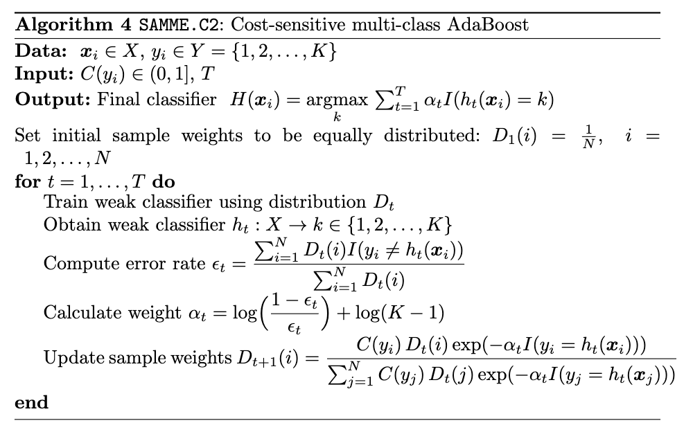

# SAMME.C2
This project provides the source code for the SAMME.C2 algorithm, a hybrid approach that combines the strengths of two distinct algorithms:
- SAMME: This algorithm is an AdaBoost variant designed for multi-class classification.
- Cost-sensitive learning, as seen in Ada.C2.
  
SAMME.C2 leverages the power of both SAMME and cost-sensitive learning to enhance its effectiveness in various classification tasks.

# Algorithm

The following algorithm describes `SAMME.C2`, a cost-sensitive multi-class AdaBoost algorithm:

# Usage
Please refer to the Python test file named samme_c2_test.ipynb for assessing the SAMME.C2 coding. This file contains test cases and usage examples for the SAMME.C2 algorithm. 

# Contributing 
Pull requests are welcome. For major changes, please open an issue first to discuss what you would like to change.

# Reference
So B, Boucher JP, Valdez EA (2021) Cost-sensitive multi-class adaboost for understanding driving behavior based on telematics. ASTIN Bulletin: The Journal of the IAA 51(3):719–751
